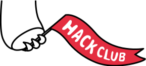

# HackClub@LCHS

## What do we do?
We make stuff! Every meeting is a mini-hackathon. No, we don't hack the CIA or anything (although, it would crazy cool if we did). A hackathon is where a bunch of people get together, find groups of 2-4, make something (an app, website, game, gadget, and other thingies), and then show it off! 

## Workshops
We provide workshops, which are just little walkthroughs of how to do something, like building your first website or how to use a game engine. Workshops are great idea-starters!