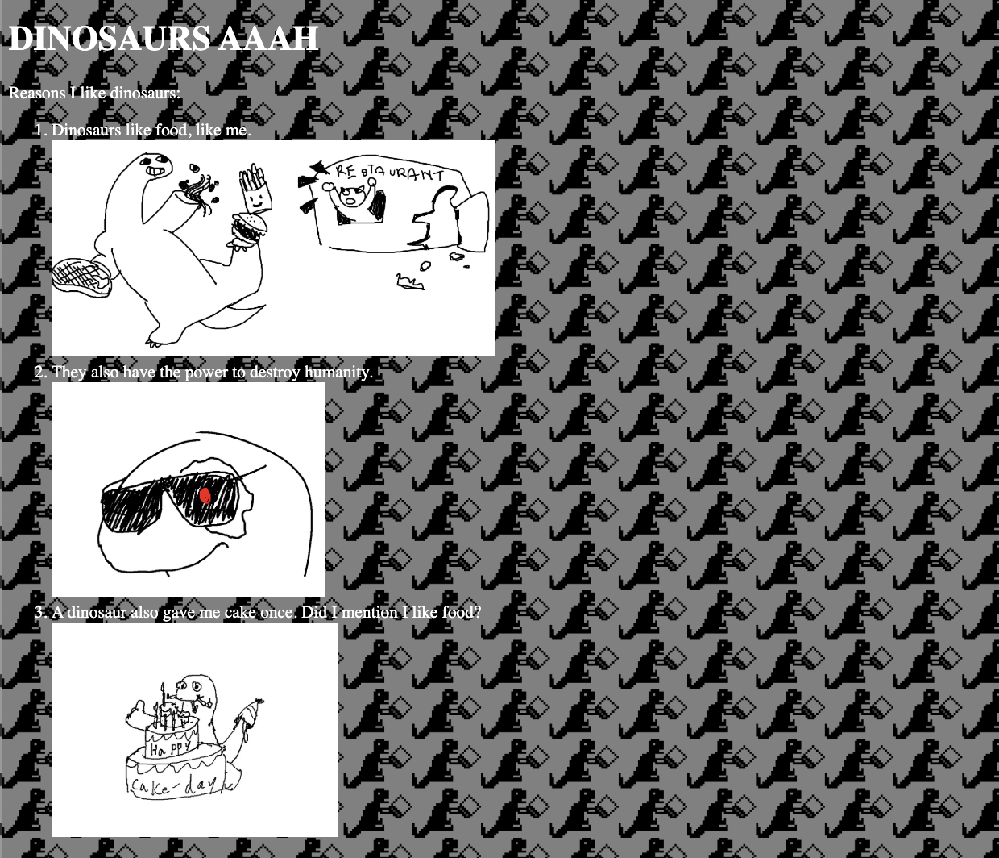

### Workshop 1
# Prehistoric Website

Alright guys.. we are going to be travelling far, far back in history into a dangerous era:

The 90s.


## Table of Contents
1. [Overview](#overview)
2. [Setup](#setup)
3. [Adding Stuff](#adding-stuff) (HTML)
    * [First Steps with HTML](#first-steps-with-html)
    * [Common Elements](#common-elements)
4. [Making It Pretty(?)](#making-it-pretty) (CSS)
5. [Going Beyond](#going-beyond)
    * [Useful Resorces](#useful-resources)
6. [Final Notes](#final-notes)


## Overview
You will be designing a wonderfully horrid site.

[](https://repl.it/@Milotrince/hcws-1-prehistoric-website)
Link to this project: https://repl.it/@Milotrince/hcws-1-prehistoric-website

Here are some more sites for your inspiration and viewing pleasure:

* [JPL in 1999](https://mars.jpl.nasa.gov/msp98/orbiter/)
* [Internet Explorer is EVIL!](http://toastytech.com/evil/)
* These sites might be blocked over school wifi:
   * [CSS Zen Garden](
http://csszengarden.com/?cssfile=https://www.brucelawson.co.uk/zen/sample.css)
   * [SpaceJam](https://www.spacejam.com/archive/spacejam/movie/jam.html)

Be creative! (And if you want to create a more modern pretty site, you totally can!)


## Setup
If you already are familiar with web design and have a preferred setup, you can skip this stage!

### Online IDE repl.it

We recommend using [repl.it](https://repl.it/). It's like Google Docs, but for code!

Make an account if you don't have one already, and create a new project (`+new repl`) with `HTML, CSS, JS` as the language.

If you are working with a team, you can share the repl by clicking `invite` up at top!


## Adding Stuff
### First Steps with HTML

Inside your html page (`index.html`), you will see some funny-looking stuffs. All the `<>`s are called **tags**. The `</>`s are closing tags. Tags are the bread and butter of HTML. You sandwich all your content inside tags.

Let's try it out! Try putting this inside of the `<body>` tags:
```html
<p>Hello World!</p>
```
and click `run`.

Awesome, you just added a paragraph **element** to your webpage! Every *thingy* on a website is an element: a block of text, an image, list, whatever. Elements can be made of more elements, or text like you just did.

Let's add another thingy. Below the `p` element, add an `img` element:
```html

```
Replace `LINK` with the image of your choice (or this one: https://raw.githubusercontent.com/Milotrince/lchs-hackclub/master/workshops/1-prehistoric-website/dino-v-cat.gif)


Very epic.

The `src` is for source. Do you see how it is inside the `img` tag? When information is inside a tag like that, they are called **attributes**. In our case, `src` is the attribute of `img` with the link to the image we want to show!

Here's what some of the other stuff in the file are:
* `<!DOCTYPE html>` is just announcing that this is an html file.
* `html` is the outermost bread of everything.
* `head` contains the page's `meta`data, like the `title` of the website (that you see on the tab of the browser).
* `body` is where all your stuffs should go! All the awesome content that will be appearing on the website, I mean.
* `link` and `script` inserts our CSS and JS into our page. We'll get to these in a bit ;)

### Common Elements
Try these out on your own!

* Text
    * `p` is for **paragraph**. As a default, it starts on a new line.
    * `h1`, `h2`, `h3` are **headers**. `h1` is biggest, and they get smaller as the number gets bigger. These are commonly used for titles, subtitles, etc.
* Lists
    * `ul` stands for unordered list. It makes a bulleted list like this one.
    * `ol` stands for ordered list. It makes a numbered list.
    * `li` is a list element. It goes inside a `ul` or `ol` element.
    * ```html
        <ul>
            <li>I am the first list element</li>
            <li>I'm second; first's the worst >:(</li>
        </ul>
        ```
* Special
    * `img` is for image! Remember the `src` should be a link to the image, and it doesn't need a separate closing tag!
        * ```html
            
          ```
    * `div` is an all-purpose tag. It stands for divider or divisor. It doesn't have any special properties or use; it's just a container. It might come in handy when you start doing stuff in the next section!


## Making It Pretty(?)
### CSS, the language of Style, Fashion, and all things Pretty

So HTML is great and all, but it's... bland. Let's change that now! Navigate to your css file (on the left, `style.css`).

No wonder we have no pizazz, our style is empty! Let's try changing the background color.
```css
body {
    background-color: magenta;
}
```

Don't forget to click run! Does it burn your eyes yet? Great.

With CSS we can add color, change fonts, adjust size, and edit positioning of HTML elements. Let's do more!
```css
p {
    border: 8px solid pink;
    font-family: cursive;
    font-size: 24px;
    text-align: center;
    color: purple;
}
```
Beautiful. Now all future `p` elements will have this style. What if we only wanted one `p` element to be styled, though? We can use classes! Instead of `p`, let's apply our style to the class `.pretty-pink` in CSS, and add the class to our element in HTML.
```css
.pretty-pink {
    border: 8px solid pink;
    ...
}
```
```html
<body>
    ...
    <p class="pretty-pink">I'm FABULOUS</p>
</body>
```
The `.` prefix in CSS indicates a class. In HTML, we can add a `class` attribute. We could even give it multiple classes, just by separating them with spaces (`class="class1 class2 ..."`).


## Going Beyond
There are tons of cool things you can do with a site. With CSS, you can add hover animations, gradient backgrounds, or [draw a hecking portrait](https://github.com/cyanharlow/purecss-francine).

There's also an aspect we haven't covered yet: JavaScript! With JavaScript, we can manipulate elements and program behaviors! We will explore JavaScript in the next workshop. Look forward to it!

### Useful Resources
* [HTML Elements](https://developer.mozilla.org/en-US/docs/Web/HTML/Element)
* [Visual CSS Reference](https://cssreference.io/)
* [CodePen.io](https://codepen.io/picks/pens/) is a fun place to explore! These are mini HTML/CSS/JS pages that other people have made.
* Other HackClub students! Just ask, and we will help you out :)
* Honestly, you can Google anything!


## Final Notes
You are now armed with everything you need to know to make a prehistoric website! Get out there and make something!


